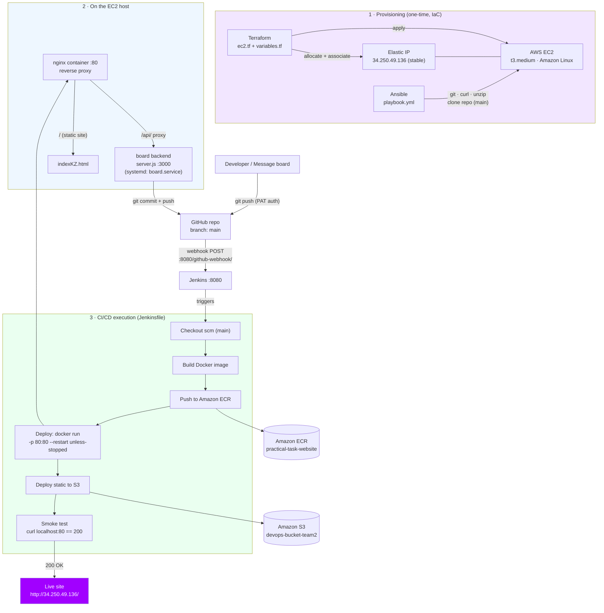

# Team 2 – DevOps Bootcamp Capstone Documentation

An end-to-end automated CI/CD pipeline: a change (code, or a message typed on a
web board) is pushed to GitHub and automatically built, deployed, and verified
on AWS — with zero manual steps.

- **Live site:** http://34.250.49.136/
- **Repository:** paradisecreate/Practical-task- (branch: `main`)
- **Region:** eu-west-1
- **Author:** KZ

---

## 1. Overview

| Layer | Tool | Purpose |
|---|---|---|
| Infrastructure | **Terraform** | Provision the EC2 instance + Elastic IP (IaC) |
| Configuration | **Ansible** | Install packages and clone the repo onto the host |
| Packaging | **Docker** | Build the website into a container image |
| Registry | **Amazon ECR** | Store the built image |
| Orchestration | **Jenkins** | Build → push → deploy → smoke test |
| Proxy | **nginx** | Single public entrypoint on port 80 |
| Backend | **Node.js (`server.js`)** | Message board API, pushes to git |
| Storage | **Amazon S3** | Static copy of the site |

---

## 2. Architecture



---

## 3. Provisioning (one-time, Infrastructure as Code)

### Terraform (`terraform/ec2.tf`, `terraform/variables.tf`)
- Provisions an **EC2 instance**: t3.medium, Amazon Linux (auto AMI lookup), IMDSv2 required.
- Allocates and associates an **Elastic IP** (`34.250.49.136`) so the public
  address stays stable across reboots — the webhook target never breaks.

```bash
cd terraform
terraform init
terraform fmt
terraform validate
terraform plan
terraform apply
```

### Ansible (`ansible/playbook.yml`)
- Installs `git`, `curl`, `unzip`.
- Clones the repository (branch `main`) onto the host.

---

## 4. What runs on the EC2 host

| Component | Port | Notes |
|---|---|---|
| **Jenkins** | 8080 | CI/CD orchestrator |
| **nginx container** | 80 | Reverse proxy — the only public entrypoint |
| **Website container** | (behind nginx) | Serves `indexKZ.html` |
| **Board backend** (`server.js`) | 3000 | Runs as systemd `board.service`, `Restart=always` |

**Why nginx on port 80?** The corporate network blocks non-standard ports
(3000, 8081, etc.), so nginx fronts everything on port 80: it serves the static
site at `/` and proxies `/api/` to the backend on 3000.

**nginx config (`docker/default.conf`):**
```nginx
listen 80;
root /usr/share/nginx/html;
index indexKZ.html;

location / { try_files $uri $uri/ =404; }
location /api/ { proxy_pass http://host.docker.internal:3000; }
```

---

## 5. The message board backend (`server.js`)

A minimal Node.js server (built-in modules only) that turns a web submission
into a git commit.

- **Security:** requires a passphrase via the `X-Board-Secret` header, compared
  with `crypto.timingSafeEqual` (constant-time). Fails closed if `BOARD_SECRET`
  is unset or under 8 characters.
- **Input handling:** validates the message (non-empty string, ≤500 chars),
  escapes HTML to prevent XSS, and inserts the card before a marker in the page.
- **Git flow:** `git add` → `git commit` → `git pull --rebase origin main`
  (self-heal if the remote moved) → `git push origin main`.
- **Runs no shell:** uses `execFile` for all git calls (no command injection).

**Runs as a systemd service so it survives reboots:**
```ini
# /etc/systemd/system/board.service
[Service]
User=ssm-user
WorkingDirectory=/home/ssm-user/Practical-task-
EnvironmentFile=/etc/board.env
ExecStart=/usr/bin/node server.js
Restart=always
```

Restart after pulling new code:
```bash
sudo systemctl restart board.service
```

---

## 6. Trigger chain (how a push becomes a deploy)

1. A **git push** lands on GitHub `main` — from a developer, or from the board
   backend (authenticated with a Personal Access Token).
2. GitHub fires a **webhook** → `POST http://34.250.49.136:8080/github-webhook/`.
3. Jenkins receives it and **starts the pipeline**.

> The Elastic IP is what keeps this working. When the instance IP changed
> overnight, the webhook pointed at a dead address and auto-deploy silently
> stopped — associating the EIP fixed it permanently.

---

## 7. CI/CD pipeline (`jenkins/Jenkinsfile`)

Six stages:

| # | Stage | What it does |
|---|---|---|
| 1 | **Checkout scm** | Pulls `main` |
| 2 | **Build Docker image** | Packages the site (`Dockerfile` + `default.conf`) |
| 3 | **Push to ECR** | Image → `practical-task-website` |
| 4 | **Deploy** | `docker run -p 80:80 --restart unless-stopped --add-host=host.docker.internal:host-gateway` |
| 5 | **Deploy to S3** | Static copy → `devops-bucket-team2` |
| 6 | **Smoke test** | `curl localhost:80` must return **HTTP 200**, else the build fails |

Environment: `AWS_REGION=eu-west-1`, `ACCOUNT_ID=597765856364`,
`ECR_REPO=practical-task-website`, `IMAGE_TAG=BUILD_NUMBER`,
`CONTAINER=practical-task-website`, `S3_BUCKET=devops-bucket-team2`.

---

## 8. Result

- The live site updates automatically at **http://34.250.49.136/**.
- New message cards appear on the board with **zero manual steps**.
- A green smoke test proves the site is actually serving (HTTP 200).

---

## 9. Reboot survival

| Component | Mechanism |
|---|---|
| Website container | `docker run --restart unless-stopped` |
| Board backend | systemd `board.service` (`Restart=always`, enabled) |
| Public IP | Elastic IP association (never changes) |

---

## 10. Key design decisions

- **Everything on port 80** — works around the corporate firewall blocking
  non-standard ports; nginx multiplexes site + API.
- **Elastic IP** — stable address so the webhook and links never break.
- **Self-healing pushes** — the backend rebases before pushing, so concurrent
  board submissions don't collide.
- **Fail-closed security** — the backend refuses to start without a strong
  passphrase, and every submission is validated and HTML-escaped.

---

## 11. Team

| Member | Area |
|---|---|
| Edgars Radzivilcuks | Terraform (IaC) & repository owner |
| Minnu Binesh Jiji | Terraform EC2 instance creation & Docker image creation |
| Nikunj Patel | Docker & AMI |
| Katrina Zabarovska | Jenkins CI/CD pipeline |
| Zlata Litvjakova | AWS networking & access |
| Anton Chumachenko | Ansible (non-active) |

> The team worked together on a shared week-long call, pairing on tasks as well
> as owning individual areas — so responsibilities overlap by design.

---

## 12. The Future Improvements

Although the current version of the project provides a working automated deployment process, there are several areas that could be improved in the future to make the infrastructure more reliable, secure, maintainable, and closer to a production-grade DevOps environment.

One of the main future improvements would be to make **Terraform the single source of truth for all AWS infrastructure used by the project**. At the moment, the automated infrastructure already covers the main application resources, such as the EC2 instance, ECR repository, S3 bucket, CloudWatch monitoring resources, and the EC2 bootstrap process. However, some infrastructure components may still be created or configured manually. A good example is the Elastic IP address. In the current implementation, the Elastic IP can be attached manually through the AWS Management Console. While this approach is acceptable for the bootcamp environment, it means that Terraform does not control the complete infrastructure lifecycle. In the future, the Elastic IP could also be managed by Terraform so that both `terraform apply` and `terraform destroy` would manage the entire environment consistently.

Terraform state management should also be improved. During development, Terraform state may be stored locally in a Codespace. This creates a risk because deleting the Codespace could also remove the local `terraform.tfstate` file. Without the original state file, Terraform no longer knows which AWS resources it previously created, even if these resources still exist in AWS. A future version of the project should therefore use a **remote Terraform backend**, for example an S3 bucket for Terraform state storage. Remote state would make infrastructure management independent from a specific developer machine or Codespace and would allow the project to be recreated or destroyed more reliably.

The project should also continue improving the **resource cleanup process**. The current Terraform configuration can be designed so that the ECR repository uses `force_delete = true` and the S3 bucket uses `force_destroy = true`. This allows Terraform to remove Docker images from ECR and website objects from S3 during `terraform destroy`. The EC2 root EBS volume should also use `delete_on_termination = true`. These settings reduce the chance of abandoned resources remaining in the AWS account. In the future, additional automated checks could be introduced after `terraform destroy` to verify that no project-specific resources remain and therefore no unnecessary cloud costs continue accumulating.

Another important improvement concerns **GitHub authentication for the application backend**. The message board backend can modify the website files and perform Git operations against the `main` branch. The board itself is protected using the fixed passphrase `DevOpsBCTeam2`, but this passphrase only authorizes requests to the application API. It does not provide authentication for GitHub. A separate Git authentication mechanism is still required for operations such as `git pull`, `git commit`, and `git push`. In the current bootcamp implementation, this can be solved using a GitHub token or another credential mechanism. In a more mature implementation, the project should avoid storing GitHub credentials directly in source code or configuration files. A better solution would be to use a GitHub deploy key, GitHub App, Jenkins credentials, AWS Secrets Manager, or another secure secret-management mechanism.

The same principle applies to the board passphrase. A fixed passphrase is convenient for testing and demonstration because every newly created EC2 instance uses the same value. However, because the value is defined in infrastructure or configuration code, anyone with repository access can see it. In a production environment, application secrets should not be committed to Git. A future implementation could retrieve the board secret from **AWS Secrets Manager or AWS Systems Manager Parameter Store** during the Ansible bootstrap process. This would keep the application configuration reproducible while separating sensitive information from source code.

The **branch structure** could also be simplified. During development, separate branches such as `main`, `terraform-automation`, and `zl-sec-test` were useful for testing infrastructure automation and monitoring independently. However, once the automated implementation has been verified, `main` should become the definitive version of the project. All bootstrap references, Jenkins Job DSL configuration, backend Git configuration, and Terraform `user_data` should therefore use `main`. This avoids a situation where infrastructure is deployed from `main` while the EC2 instance or Jenkins pipeline continues cloning or monitoring an older development branch.

The Jenkins configuration can also be improved further. The project already uses **Jenkins Configuration as Code (JCasC)** and Job DSL to automatically configure Jenkins and create the pipeline job. This is a significant improvement compared with manually configuring Jenkins through the web interface. In the future, the Jenkins setup could become even more reproducible by explicitly pinning Jenkins plugin versions and automatically validating the JCasC configuration before deployment. Backup and recovery of Jenkins configuration could also be introduced if Jenkins were used for a long-running production environment.

The current CI/CD pipeline could also benefit from additional **DevSecOps stages**. The existing architecture focuses primarily on building the Docker image, pushing it to Amazon ECR, deploying the website, validating the application, and publishing monitoring metrics. A future pipeline could include source-code security scanning, dependency vulnerability scanning, Docker image scanning, secret detection, and Infrastructure as Code scanning. Tools such as Trivy, Checkov, tfsec, or similar solutions could be introduced depending on the project requirements. These stages would allow security problems to be detected earlier in the CI/CD process rather than after deployment.

The Docker deployment itself could also be made more resilient. At the moment, the Jenkins pipeline deploys the Nginx container to the EC2 instance and exposes the website on port 80. Nginx forwards `/api/` requests to the Node.js backend running on port 3000. This architecture is simple and appropriate for the project, but a future version could introduce container health checks, automatic restart policies, versioned rollback mechanisms, or Docker Compose to make the relationship between the frontend container and backend service more explicit.

Another improvement would be to reduce the amount of deployment logic tied directly to a single EC2 instance. The current design uses one EC2 instance for Jenkins, Docker, and the Node.js backend. This is efficient for a bootcamp environment because it reduces complexity and cost, but it also creates a single point of failure. In a production-oriented architecture, Jenkins could run independently from the application infrastructure. The application could then be deployed to ECS, EKS, AWS App Runner, or another managed container platform. This would allow application infrastructure to scale independently from the CI/CD server.

The project currently also deploys website content to **Amazon S3** in addition to the Docker deployment. In the future, the purpose of each deployment target could be made more explicit. If S3 becomes the main static frontend hosting solution, Amazon CloudFront could be placed in front of the S3 bucket to provide HTTPS, caching, and improved global delivery. The backend API could then be exposed separately through an Application Load Balancer, API Gateway, or another managed endpoint. Alternatively, if the Docker/Nginx deployment remains the main website runtime, S3 could instead be used primarily as a secondary deployment target, backup, or demonstration of multiple AWS deployment mechanisms.

Monitoring is another area that can be expanded significantly. The project already introduces **Amazon CloudWatch**, including the CloudWatch Agent, EC2 CPU monitoring, memory and disk metrics, alarms, dashboards, and custom Jenkins pipeline metrics such as `PipelineSuccess` and `PipelineFailure`. In the future, these metrics could be extended with application-specific information such as HTTP request count, response time, backend errors, Docker container health, Jenkins build duration, and deployment frequency. Centralized application logs could also be sent to CloudWatch Logs so that infrastructure metrics and application logs can be investigated from the same monitoring platform.

CloudWatch alarms could eventually be connected to an automatic notification system such as **Amazon SNS**. For example, the team could receive an email or another notification when CPU utilization becomes too high, memory usage exceeds a threshold, the EC2 instance fails a status check, or several Jenkins builds fail consecutively. This would transform the current monitoring implementation from passive observability into an active alerting system.

The pipeline trigger mechanism could also be improved. Jenkins can periodically poll the Git repository, but polling creates unnecessary requests and introduces a delay between a GitHub change and the start of a deployment. A more efficient solution would be to use a **GitHub webhook** so that GitHub immediately informs Jenkins when changes are pushed to `main`. This would make the CI/CD process faster and more event-driven.

Another valuable future improvement would be introducing separate environments such as **development, staging, and production**. Currently, the project primarily represents a single deployment environment. Terraform modules or Terraform workspaces could be used to create similar infrastructure with different parameters. Jenkins could then deploy changes first to a staging environment, run smoke tests, and only promote a successful build to production after automated validation or manual approval.

The project could also improve its testing strategy. The current pipeline performs deployment and smoke tests to confirm that the website and backend are reachable. Additional automated tests could verify API responses, HTML content, Nginx configuration, CloudWatch Agent status, S3 website availability, and Docker container health. Tests could also confirm that the deployed Docker image corresponds to the expected Jenkins build number. This would make pipeline success represent not only a successful command execution but an actually functioning application.

Infrastructure validation could be strengthened as well. Before any deployment, Jenkins or a dedicated infrastructure pipeline could execute:

`terraform fmt -check`, `terraform validate`, and `terraform plan`.

The generated Terraform plan could be reviewed before `terraform apply`, especially when infrastructure changes include resource replacement or deletion. This would reduce the risk of accidentally destroying or recreating important resources.

A further improvement would be to reduce the amount of **hard-coded AWS configuration**. For example, the security group identifier and some bootcamp-specific infrastructure values may currently be defined directly in Terraform. This is practical while working with a controlled bootcamp account, but reusable infrastructure should accept these values through variables or discover them through Terraform data sources. The same Terraform code could then work across different AWS accounts without modifying source files.

Cost management could also become part of the architecture. The project already follows several FinOps-friendly practices because infrastructure can be destroyed after use. Additional tags could be applied consistently to every AWS resource, such as project name, environment, team, owner, and creation purpose. AWS Budgets or Cost Explorer could then be used to monitor the project's cloud spending. Automated cleanup of development infrastructure outside working hours could also reduce unnecessary costs.

Finally, the project documentation itself should continue evolving together with the infrastructure. Architecture diagrams, Terraform resource descriptions, pipeline flow diagrams, deployment instructions, troubleshooting steps, and cleanup procedures should reflect the actual repository rather than an idealized architecture. Keeping documentation synchronized with the code would make it easier for another team member to understand how GitHub, Terraform, Ansible, Jenkins, Docker, ECR, S3, EC2, the Node.js backend, and CloudWatch interact.

Overall, the current implementation already demonstrates the complete DevOps lifecycle: infrastructure provisioning with Terraform, server configuration with Ansible, CI/CD automation with Jenkins, containerization with Docker, image storage in Amazon ECR, deployment to EC2 and S3, application interaction with GitHub, and infrastructure monitoring through Amazon CloudWatch. The next stage of development would therefore focus less on adding isolated tools and more on improving reliability, security, state management, observability, portability, and automation. These improvements would gradually transform the bootcamp solution into an architecture that more closely resembles a real production DevOps environment.

