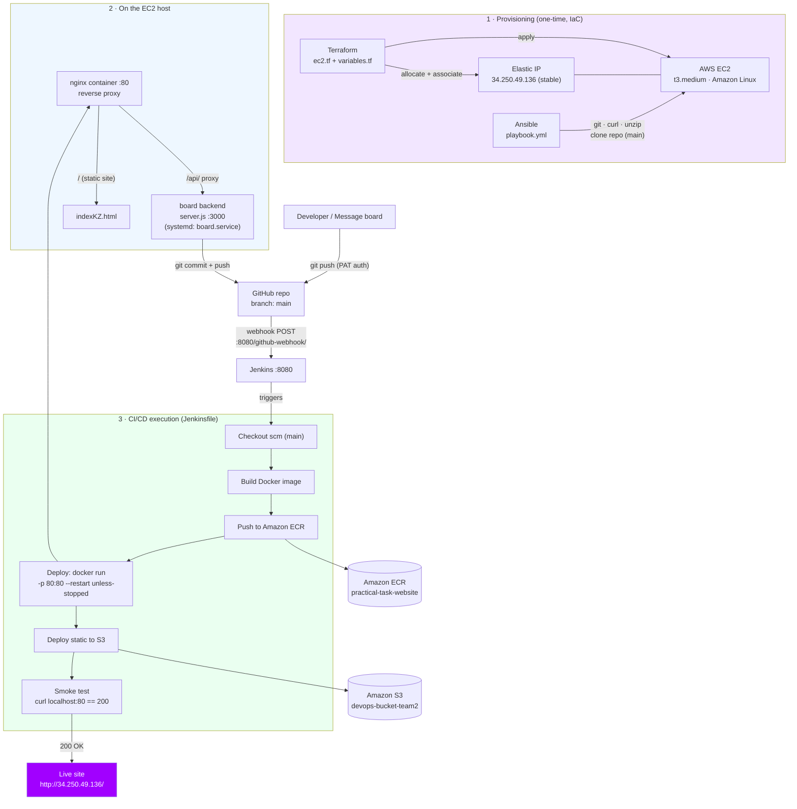

# Team 2 – DevOps Bootcamp Capstone Documentation

An end-to-end automated CI/CD pipeline: a change (code, or a message typed on a
web board) is pushed to GitHub and automatically built, deployed, and verified
on AWS — with zero manual steps.

- **Live site:** http://34.250.49.136/
- **Repository:** paradisecreate/Practical-task- (branch: `main`)
- **Region:** eu-west-1
- **Author:** KZ

---

## 1. Overview

| Layer | Tool | Purpose |
|---|---|---|
| Infrastructure | **Terraform** | Provision the EC2 instance + Elastic IP (IaC) |
| Configuration | **Ansible** | Install packages and clone the repo onto the host |
| Packaging | **Docker** | Build the website into a container image |
| Registry | **Amazon ECR** | Store the built image |
| Orchestration | **Jenkins** | Build → push → deploy → smoke test |
| Proxy | **nginx** | Single public entrypoint on port 80 |
| Backend | **Node.js (`server.js`)** | Message board API, pushes to git |
| Storage | **Amazon S3** | Static copy of the site |

---

## 2. Architecture



---

## 3. Provisioning (one-time, Infrastructure as Code)

### Terraform (`terraform/ec2.tf`, `terraform/variables.tf`)
- Provisions an **EC2 instance**: t3.medium, Amazon Linux (auto AMI lookup), IMDSv2 required.
- Allocates and associates an **Elastic IP** (`34.250.49.136`) so the public
  address stays stable across reboots — the webhook target never breaks.

```bash
cd terraform
terraform init
terraform fmt
terraform validate
terraform plan
terraform apply
```

### Ansible (`ansible/playbook.yml`)
- Installs `git`, `curl`, `unzip`.
- Clones the repository (branch `main`) onto the host.

---

## 4. What runs on the EC2 host

| Component | Port | Notes |
|---|---|---|
| **Jenkins** | 8080 | CI/CD orchestrator |
| **nginx container** | 80 | Reverse proxy — the only public entrypoint |
| **Website container** | (behind nginx) | Serves `indexKZ.html` |
| **Board backend** (`server.js`) | 3000 | Runs as systemd `board.service`, `Restart=always` |

**Why nginx on port 80?** The corporate network blocks non-standard ports
(3000, 8081, etc.), so nginx fronts everything on port 80: it serves the static
site at `/` and proxies `/api/` to the backend on 3000.

**nginx config (`docker/default.conf`):**
```nginx
listen 80;
root /usr/share/nginx/html;
index indexKZ.html;

location / { try_files $uri $uri/ =404; }
location /api/ { proxy_pass http://host.docker.internal:3000; }
```

---

## 5. The message board backend (`server.js`)

A minimal Node.js server (built-in modules only) that turns a web submission
into a git commit.

- **Security:** requires a passphrase via the `X-Board-Secret` header, compared
  with `crypto.timingSafeEqual` (constant-time). Fails closed if `BOARD_SECRET`
  is unset or under 8 characters.
- **Input handling:** validates the message (non-empty string, ≤500 chars),
  escapes HTML to prevent XSS, and inserts the card before a marker in the page.
- **Git flow:** `git add` → `git commit` → `git pull --rebase origin main`
  (self-heal if the remote moved) → `git push origin main`.
- **Runs no shell:** uses `execFile` for all git calls (no command injection).

**Runs as a systemd service so it survives reboots:**
```ini
# /etc/systemd/system/board.service
[Service]
User=ssm-user
WorkingDirectory=/home/ssm-user/Practical-task-
EnvironmentFile=/etc/board.env
ExecStart=/usr/bin/node server.js
Restart=always
```

Restart after pulling new code:
```bash
sudo systemctl restart board.service
```

---

## 6. Trigger chain (how a push becomes a deploy)

1. A **git push** lands on GitHub `main` — from a developer, or from the board
   backend (authenticated with a Personal Access Token).
2. GitHub fires a **webhook** → `POST http://34.250.49.136:8080/github-webhook/`.
3. Jenkins receives it and **starts the pipeline**.

> The Elastic IP is what keeps this working. When the instance IP changed
> overnight, the webhook pointed at a dead address and auto-deploy silently
> stopped — associating the EIP fixed it permanently.

---

## 7. CI/CD pipeline (`jenkins/Jenkinsfile`)

Six stages:

| # | Stage | What it does |
|---|---|---|
| 1 | **Checkout scm** | Pulls `main` |
| 2 | **Build Docker image** | Packages the site (`Dockerfile` + `default.conf`) |
| 3 | **Push to ECR** | Image → `practical-task-website` |
| 4 | **Deploy** | `docker run -p 80:80 --restart unless-stopped --add-host=host.docker.internal:host-gateway` |
| 5 | **Deploy to S3** | Static copy → `devops-bucket-team2` |
| 6 | **Smoke test** | `curl localhost:80` must return **HTTP 200**, else the build fails |

Environment: `AWS_REGION=eu-west-1`, `ACCOUNT_ID=597765856364`,
`ECR_REPO=practical-task-website`, `IMAGE_TAG=BUILD_NUMBER`,
`CONTAINER=practical-task-website`, `S3_BUCKET=devops-bucket-team2`.

---

## 8. Result

- The live site updates automatically at **http://34.250.49.136/**.
- New message cards appear on the board with **zero manual steps**.
- A green smoke test proves the site is actually serving (HTTP 200).

---

## 9. Reboot survival

| Component | Mechanism |
|---|---|
| Website container | `docker run --restart unless-stopped` |
| Board backend | systemd `board.service` (`Restart=always`, enabled) |
| Public IP | Elastic IP association (never changes) |

---

## 10. Key design decisions

- **Everything on port 80** — works around the corporate firewall blocking
  non-standard ports; nginx multiplexes site + API.
- **Elastic IP** — stable address so the webhook and links never break.
- **Self-healing pushes** — the backend rebases before pushing, so concurrent
  board submissions don't collide.
- **Fail-closed security** — the backend refuses to start without a strong
  passphrase, and every submission is validated and HTML-escaped.

---

## 11. Team

| Member | Area |
|---|---|
| Edgars Radzivilcuks | Terraform (IaC) & repository owner |
| Minnu Binesh Jiji | Terraform EC2 instance creation & Docker image creation |
| Nikunj Patel | Docker & AMI |
| Katrina Zabarovska | Jenkins CI/CD pipeline |
| Zlata Litvjakova | AWS networking & access |
| Anton Chumachenko | Ansible (non-active) |

> The team worked together on a shared week-long call, pairing on tasks as well
> as owning individual areas — so responsibilities overlap by design.
